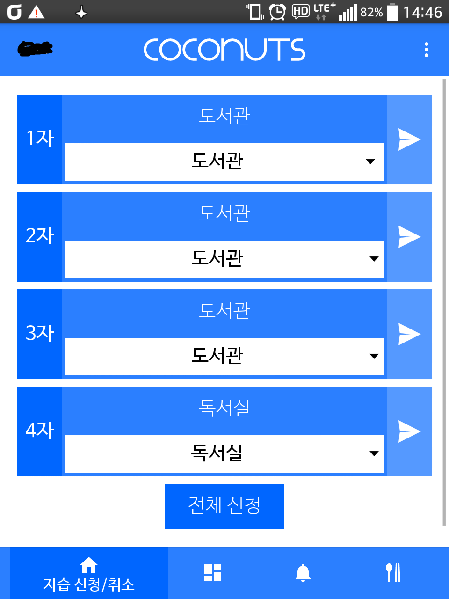
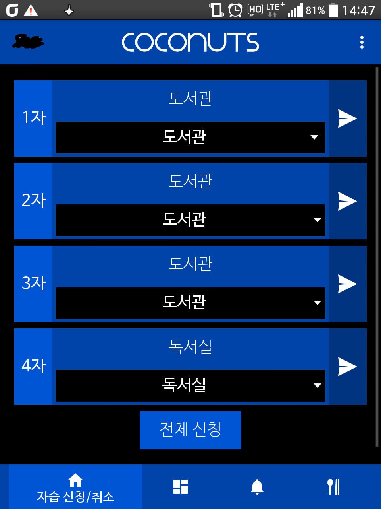
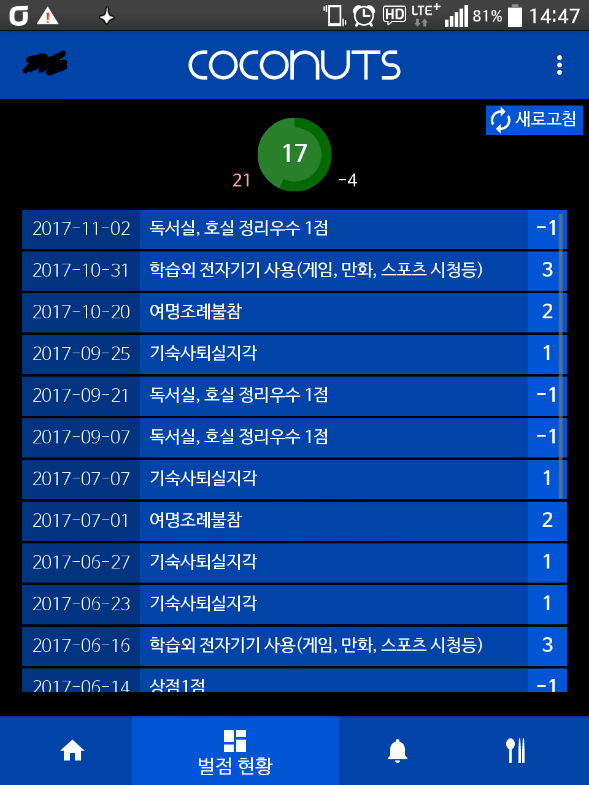
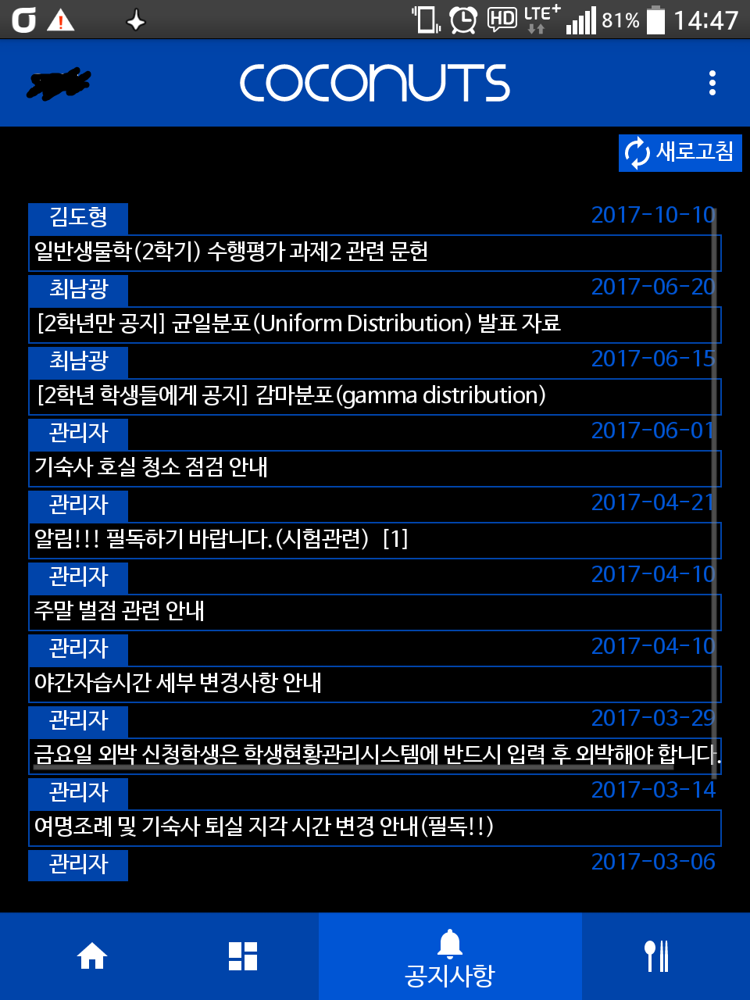
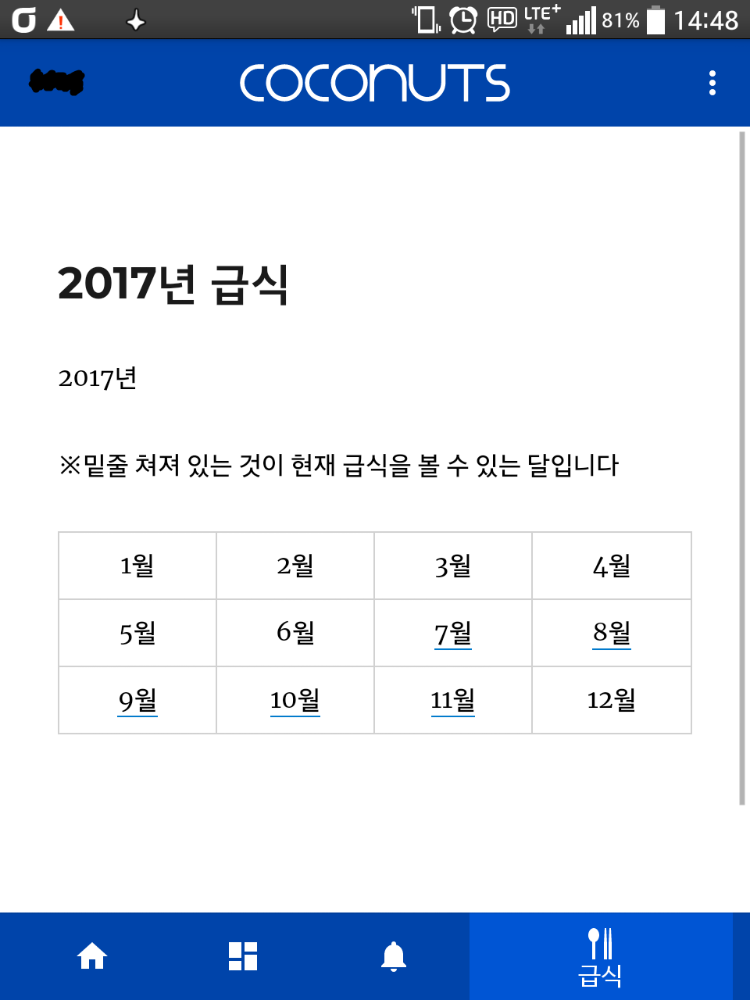

# Coconuts MOBILE v1.0
##### Made by Orb_H / Design by Heartade

## 0. Download
<a href="http://raw.githubusercontent.com/Orb-H/Coconuts/master/Downloads/Coconuts%20MOBILE%20v1.0.apk">최신 버전 다운</a>

## Ⅰ. Main Features
### 1. 자습 빼기
   - **세미나실 6개를 제외한** 나머지 위치를 자유롭게 뺄 수 있습니다.
   - 물론 **4시 반까지**입니다. 그 이후로도 가능했다고 생각하면 그건 큰 오산입니다.
   - 세미나실은 다른 데보다 빼는 게 어렵습니다. 그래서 나중에 추가하거나 안 추가하거나 할텐데 곧 졸업이라 후자일 가능성이 높습니다.
   - Screenshot
   

   
[스크린샷 보기/숨기기]

<table>
   <thead>
      <td>Classic</td>
      <td>Dark</td>
   </thead>
   <tr>
      <td></td>
      <td></td>
   </tr>
</table>

### 2. 벌점 체크
   - 자신이 현재까지 받은 벌점/상점 목록을 받은 양과 함께 나타내줍니다.
   - 받은 총량을 벌점과 상점을 나눠서 표시하여 총 벌점이 30점에 가까운데 받은 상점 30점인 친구들에게 위기의식을 심어줍니다.
   - Screenshot
   

   
[스크린샷 보기/숨기기]

<table border=0>
   <thead>
      <td>Classic</td>
      <td>Dark</td>
   </thead>
   <tr>
      <td></td>
      <td></td>
   </tr>
</table>
   

### 3. 공지사항 보기
   - 공지사항을 작성자, 날짜, 제목을 표시해줍니다.
   - 공지사항의 제목을 클릭하면 공지사항의 내용과 댓글이 보입니다.
   - 공지의 세부사항이 보이는 곳에서 아마도 댓글을 달 수 있을 것입니다. 댓글 보내는 게 있다고 아무렇게나 쓰고 올렸다간 그대로 올라갈 수도 있고 씹힐 수도 있고 저도 모르겠습니다.
   - Screenshot
   

   
[스크린샷 보기/숨기기]

<table border=0>
   <thead>
      <td>Classic</td>
      <td>Dark</td>
   </thead>
   <tr>
      <td></td>
      <td></td>
   </tr>
</table>
   

### 4. 급식 보기
   - 이 어플리케이션의 제작자가 매달 말 다음 달의 급식을 다운받아서 일일이 적어놓는 사이트와 연결되어있습니다.
   - 급식은 **매달 1일 00:00 ~ 00:30에 1분 간격으로 업로드**됩니다. 이 시간에는 링크가 오작동될 수 있습니다.
   - Screenshot
   

   
[스크린샷 보기/숨기기]

<table border=0>
   <thead>
      <td>Classic</td>
      <td>Dark</td>
   </thead>
   <tr>
      <td></td>
      <td></td>
   </tr>
</table>
   

   

## Ⅱ. Sub Features
### 1. 다른 학번으로 로그인
   - 어차피 자기 폰에 깔아서 쓸 거라 의미없을 것 같지만 아직도 피처폰을 쓰는 불쌍한 친구들을 도와주라는 뜻에서 다른 학번으로 로그인할 수 있게 만들어놓았습니다.
   - 학번 변경 후 자습 신청 시 기존 학번의 현황이 바뀌는 오류가 있는 듯하니 자기 폰 쓰겠다는 친구들에게는 웬만해서는 자기 노트북 쓰라고 하세요.
### 2. 디자인 변경
   - 제 폰같은 경우는 파란색의 출력이 약해서 기본 테마로는 색 구분이 잘 안되서 조금 다른 색을 사용하는 Dark Theme를 만들었습니다.
   - 지금은 Classic Theme와 Dark Theme 두 종류밖에 없지만 몇 가지 추가할 예정이며 **'이런 색 배합이면 좋겠다'싶은 것들은 여기에 댓글을 달거나 orb.cov@gmail.com으로 메일을 보내주시기 바랍니다.**
### 3. 언어 변경
   - 부가 기능 중에서 가장 쓸데없는 기능으로 언어를 영어로 바꿀 수 있습니다. 근데 어차피 발번역이라 별로 쓸모도 없고 자습 위치와 급식은 한글로 표시됩니다.

## Ⅲ. Updates
### v1.0
   - 첫 업로드입니다.

## Ⅳ. Feedback
그 이외의 문의사항이나 피드백, 버그 제보는 orb.cov@gmail.com으로 보내주시면 감사하겠습니다.

### Support for Themes
위에서 언급하였듯이 원하는 색 배합이 있는 경우에 메일로 보내주시면 됩니다(개발자를 빡세게 굴려주세요!). 참고를 위하여 현재 존재하는 테마들의 색 목록을 여기에 적어두겠습니다.

|색 종류|Classic Theme|Dark Theme|설명|
|:---:|:---:|:---:|:---:|
|`color1`        | `#0066ff` | `#0055d4` | 메인 색 1(자습 창에서 '1자' 써있는 칸의 배경색) |
|`color2`        | `#2b7fff` | `#0044aa` | 메인 색 2(자습 창에서 자습 위치 써있는 칸의 배경색) |
|`color3`        | `#5599ff` | `#003380` | 메인 색 3(자습 창에서 종이비행기 그려져있는 칸의 배경색) |
|`color_text1`   | `#ffffff` | `#ffffff` | color1의 배경을 가진 칸의 글씨색 |
|`color_text2`   | `#ffffff` | `#ffffff` | color2의 배경을 가진 칸의 글씨색 |
|`color_text3`   | `#ffffff` | `#ffffff` | color3의 배경을 가진 칸의 글씨색 |
|`color_back`    | `#ffffff` | `#000000` | 기본 배경색 |
|`color_backtext`| `#000000` | `#ffffff` | 기본 글씨색 |
|`brightness`    |1|0.5| 벌점을 나타내는 원형 그래프의 색의 밝은 정도를 나타내는 값 |

 
곧 졸업이라 업데이트는 몇 번 못합니다. 이 앱에 관심이 있거나 앱이 돌아가는 원리가 궁금하신 분들은 orb.cov@gmail.com으로 메일을 보내주시길 바랍니다.
